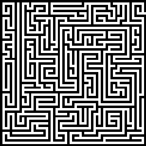

# Maze 

Simple program to solve mazes in .png where each tile is 1x1 pixel.
Made for mazes generated [here](http://hereandabove.com/maze/mazeorig.form.html):
Path width and wall width has to be set to 1 pixel.

There's also an option to generate mazes, but the algorithm is poorly implemented, resulting in uninteresting mazes.

## Solving:
Creates a graph with nodes at each intersection, uses Dijkstras algorithm to find the shortest path.

Outputs a .png and an animated gif with the solution.

## Generating:
Uses a Randomized Prim's algorithm which can be found on [wikipedia](https://en.wikipedia.org/wiki/Maze_generation_algorithm)

There is something wrong with the implementation, so the mazes don't look like they're supposed to.

## Libraries used:
[Lodepng](https://github.com/lvandeve/lodepng#lodepng)

[gif.h](https://github.com/ginsweater/gif-h)
	
	
Kent Odde, April 2019
